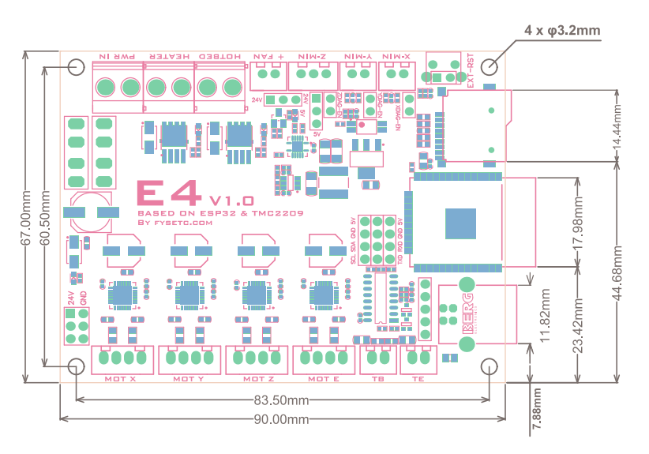

## Product Introduction


The E4 board is a minimal 3D printer control board based on the ESP32 microcontroller from ESPRESSIF, with built-in Wi-Fi and Bluetooth. The controller speed is up to 240MHz, 16M flash.

## Features

- Compact size: 90mm x 67mm
- Native Wi-Fi support
- 12V to 24V input power supply, 3 power outputs and 3 5V outputs
- 4 * **TMC2209** stepper drives: X, Y, Z and E axis
- Onboard TF card socket
- CH340 for high speed USB serial connection 
- X, Y, and Z min endstops; also supports sensorless homing
- Allows the use of a Z-axis probe, such as an inductive sensor, running on the input supply voltage (12V to 24V) or 5V
- A controllable fan, you can choose the power supply voltage (12/24V) or 5V voltage for it
- Xh2.54 connector, firm and easy to plug
- PCB：
  - Black matte ink,lead-free tin spray process
  - High quality, High temperature FR4-TG130 PCB

## Why do you need this board?

If you want to be able to control your 3D printer via a web browser without having to buy extra components like a Raspberry Pi for Octoprint, this board is for you. If you run a printing farm and want to be able to start prints remotely via Wi-Fi, this board is for you. 

### Native Wi-Fi support

FYSETC E4 is based on the ESP32 microcontroller, so the E4 supports 802.11 b/g/n protocols, and a custom fork of Marlin firmware can be used on the board to allow the board to be controlled via a web browser.

This removes the need for the traditional LCD controllers that most other boards use. There is also no need to connect a Raspberry Pi in order to control the printer via a web interface. The web interface is the popular ESP3D webUI, which runs natively on the custom Marlin fork. The printer can then be controlled via any web browser, be it a PC, smart phone, or tablet.

For example, you can slice your 3D model using a slicing software on your PC, then use your PC's web browser to connect to the printer, send the sliced GCODE file to the printer via Wi-Fi. Then, using the same web browser, you can tell the printer to start printing away.

### Trinamic stepper drivers

FYSETC E4 use the latest ,best stepper drvier : TMC2209.

1. Ultra quiet
2. Good heat dissipation
3. Max current up to 2A
4. Large heat sink,good heat dissipation
5. Support sensorless-homing function.

### High voltage for probes

One common problem when using inductive or capactive probes is the voltage which they are powered at. These probes are usually connected to the Z endstop, which is powered directly by the microcontroller. This means 5V or 3.3V, but these probes are not designed for such low voltages. Instead, they are usually designed for operation at 6V or more. Using a lower voltage to operate such probes reduces their detection distance, and therefore their effectiveness.

The FYSETC E4 has a dedicated connector for such a Z probe which uses the voltage of the power supply to power the probe. If you are using 12V for the power supply, the probe will be running on 12V, and vice versa for when using a 24V power supply. This allows the probe to operate within its specifications, delivering optimal detection distances.

### Onboard or External Antenna

There are two versions of the E4 board. One is that the antenna of the WiFi module is onboard. And the other is a WiFi module with an external antenna. This option give you the choice  that if you want to install board in a closed box, the external antenna can avoid the problem of WIFI signal weakening in a confined space.

| Onboard Antenna              | External Antenna             |
| ---------------------------- | ---------------------------- |
|  |  |

​    

## Hardware Reasources


| Board Name       | E4                                                                                                                                                                                                                                                                         |
| ---------------- | -------------------------------------------------------------------------------------------------------------------------------------------------------------------------------------------------------------------------------------------------------------------------- |
| Latest Version   | V1.0                                                                                                                                                                                                                                                                       |
| Extruders        | 1                                                                                                                                                                                                                                                                          |
| Hotbed           | 1                                                                                                                                                                                                                                                                          |
| Controlled Fans  | 1                                                                                                                                                                                                                                                                          |
| Heaters          | 1                                                                                                                                                                                                                                                                          |
| Endstops         | 3                                                                                                                                                                                                                                                                          |
| Temp sensor      | 2                                                                                                                                                                                                                                                                          |
| Serial port chip | CH340                                                                                                                                                                                                                                                                      |
| CPU              | 240MHz [ESP32-WROOM-32E](https://www.espressif.com/sites/default/files/documentation/esp32-wroom-32e_esp32-wroom-32ue_datasheet_en.pdf), [ESP32-WROOM-32UE](https://www.espressif.com/sites/default/files/documentation/esp32-wroom-32e_esp32-wroom-32ue_datasheet_en.pdf) |
| FLASH Size       | 16MB                                                                                                                                                                                                                                                                       |
| Stepper driver   | 4 * TMC2209                                                                                                                                                                                                                                                                |
| Input            | Main PWR：12-24V 22.5A Max                                                                                                                                                                                                                                                  |
| Output           | BED+Heater OUT：15A Max                                                                                                                                                                                                                                                     |

## Jumper Introduction

**Fan power jumper**


**Z-Probe power jumper**


**Sensorless homing enable jumper**


**Sensorless homing enable jumper**


## Pin Definition

<table>
   <tr><td>Features</td><td>E4 Pin</td><td>ESP32 Pin</td><td>Pin No.</td><td>Comment</td></tr>
   <tr><td rowspan="3">X-MOTOR(1)</td><td>X-Step</td><td>27</td><td>12</td><td></td></tr>
   <tr><td>X-DIR</td><td>26</td><td>11</td><td></td></tr>
   <tr><td>X-EN</td><td>25</td><td>10</td><td></td></tr>
   <tr><td rowspan="3">Y-MOTOR(2)</td><td>Y-Step</td><td>33</td><td>9</td><td></td></tr>
   <tr><td>Y-DIR</td><td>32</td><td>8</td><td></td></tr>
   <tr><td>Y-EN</td><td>25</td><td>10</td><td></td></tr>
   <tr><td rowspan="3">Z-MOTOR(3)</td><td>Z-Step</td><td>14</td><td>13</td><td></td></tr>
   <tr><td>Z-DIR</td><td>12</td><td>14</td><td></td></tr>
   <tr><td>Z-EN</td><td>25</td><td>10</td><td></td></tr>
   <tr><td rowspan="3">E0-MOTOR(4)</td><td>E0-Step</td><td>16</td><td>27</td><td></td></tr>
   <tr><td>E0-DIR</td><td>17</td><td>28</td><td></td></tr>
   <tr><td>E0-EN</td><td>25</td><td>10</td><td></td></tr>
   <tr><td rowspan="3">SPI </td><td>MOSI</td><td>23</td><td>37</td><td></td></tr>
   <tr><td>MISO</td><td>19</td><td>31</td><td></td></tr>
   <tr><td>SCK</td><td>18</td><td>30</td><td></td></tr>
   <tr><td rowspan="2">End-stops</td><td>X-MIN</td><td>34</td><td>6</td><td>Share with X-DIAG</td></tr>
   <tr><td>Y-MIN</td><td>35</td><td>7</td><td>Share with Y-DIAG</td></tr>
   <tr><td>Z-MIN</td><td>15</td><td>23</td><td>Share with Z-DIAG</td></tr>
   <tr><td rowspan="1">FAN</td><td>FAN0</td><td>13</td><td>16</td><td></td></tr>
   <tr><td rowspan="2">Heating</td><td>E0-Heater</td><td>2</td><td>24</td><td></td></tr>
   <tr><td>Heated-Bed</td><td>4</td><td>26</td><td></td></tr>
   <tr><td rowspan="2">Temperature</td><td>TE0（THERM0）</td><td>36</td><td>4</td><td>A 4.7kOhm 0.1% temperature sensor pull up resistor is used,PT1000 can be connected directly. For PT100, an amplifier board must be used.</td></tr>
   <tr><td>TB</td><td>39</td><td>5</td><td></td></tr>
   <tr><td rowspan="2">MOTOR UART</td><td>TX1</td><td>22</td><td>35</td><td></td></tr>
   <tr><td>RX1</td><td>21</td><td>34</td><td></td></tr>
</table>


## Dimensions



---

- [Schematic and PCB files](https://github.com/FYSETC/FYSETC-E4/tree/main/hardware)

## Firmware

### How to use

The factory firmware comes flashed with the custom fork of Marlin as well as the web interface. You can get it in our [github](https://github.com/FYSETC/FYSETC-E4). Always you need to modify it base on your machine configuration. You can follow our [video](https://youtu.be/Skz7xW8TiHI) or the following steps :

1. Turn on power to the FYSETC E4, and then connect your PC, smart phone, or tablet to the SSID "MARLIN_ESP" (default password is "12345678").
2. Once connected, open a web browser, and go to "[http://192.168.0.1/](http://www.google.com/url?q=http%3A%2F%2F192.168.0.1%2F&sa=D&sntz=1&usg=AFQjCNHmcUXoQvvfhtmwWsGrZOfa2vJB6A)" which will load the ESP3D web interface.
3. Go to the "ESP3D" tab, and enter your WiFi settings (SSID and password).
4. Reset the FYSETC E4. It should now connect to your router.
5. Connect the USB cable to E4 and your PC with 115200 baudrate, and send Serial command "[ESP111]" to get the E4 IP address.
6. Use your web browser and visit the IP address you just get to access the web interface.
7. You can now update the firmware. Download the custom fork from [here](https://github.com/FYSETC/FYSETC-E4/tree/main/firmware), edit Configuration.h and Configuration_adv.h to suit your needs, then compile. In PlatformIO, you can add "upload_port = ip adderrs of your E4" to your platformio.ini file to allow OTA updates. Or, after the firmware has been compiled, use the web interface, go to "ESP3D" tab, and there is an option for firmware update that allows up to upload the firmware.bin file.

### Compile the firmware yourself

If you want to compile the firmware yourself, you need to 

1. Edit the `configuration.h` and `configuration_adv.h` file , please follow the README [here](https://github.com/luc-github/ESP3DLib).

2. Change env in `platformio.ini` to `FYSETC_E4`
   
   ```default_envs = FYSETC_E4```

#### Marlin 2.1.x

Get the code from Marlin github [here](https://github.com/MarlinFirmware/Marlin), and the related configuration [here](https://github.com/luc-github/MarlinConfigurations/tree/bugfix-2.1.x/config/examples/FYSETC/E4).

## Shop

---

- [Taobao](https://item.taobao.com/item.htm?spm=a230r.1.14.22.66cd74cfpASnTX&id=641701271442&ns=1&abbucket=1#detail)
- [Aliexpress](https://www.aliexpress.com/item/1005001703930983.html)

## Tech Support

---

Please submit any technical issue into our [github](https://github.com/FYSETC/FYSETC-E4) or [forum](http://forum.fysetc.com/) 
